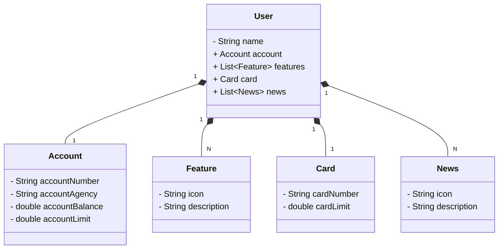

A DIO lesson project. just practcing 
**I DID NOT CREATE THIS PROJECT. THIS IS NOT MY PROJECT. PLEASE IGNORE IT

#Santander Dev Week 2023
Java RESTful API criada para a Santander Dev week.

##Diagrama de Classes

